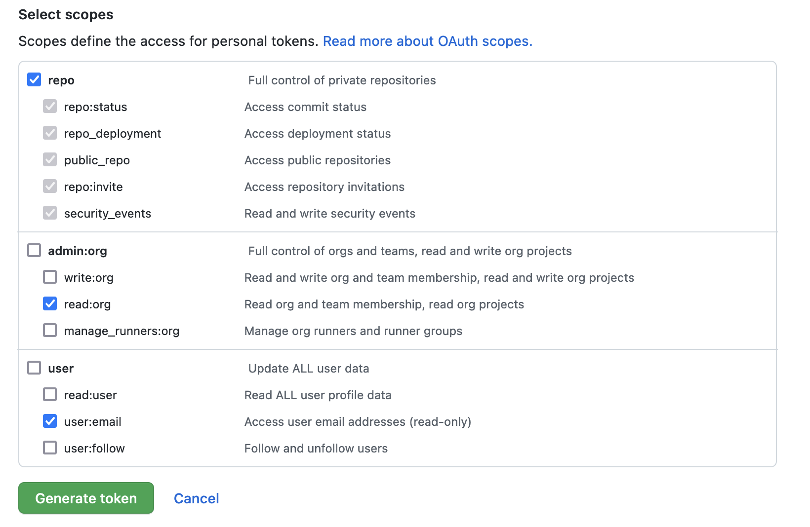

# inactive-users-action

A GitHub Action that can be run against a GitHub Organization to generate a report on user activity for a given time
period. This can be useful in detecting inactive users so that licenses can be reclaimed.

## HOW-TO på norsk

Hey! Ble litt mye å skrive engelsk kjente jeg. Her er en kjapp howto:

Scriptet leter etter inaktive brukere i Bekk-organisasjonen og kjøres som en Github-Action.

### Forberedelser:

- Lag et personlig access token. Den må ha følgene rettigheter: `read:org`, `repo`, `user:email`. Det kan lages her: https://github.com/settings/tokens.



- Legg token inn som en hemmelig miljøvariabel i repoet. Det gjøres her: https://github.com/bekk/check-inactive-users/settings/secrets/actions. Klikk "Update" på `OCTODEMO_TOKEN` som ligger under `Repository secrets`

- Ok da er du klar ✨

### Kjøring:

- Gå inn på "Action"-fanen, velg "Long Timeframe Test" og klikk "Run workflow (Branch: main).


- Når den er ferdig kjørt får du csv- og json rapport på alle brukere og hvorvidt de er "aktive eller ikke". Jeg har justert det til å gjelde 360 dager (kan justeres i `.github/long_timeframe_test.yml`). Rapporten finner du ved å klikke på workflow'en og under "Artifacts".

- Filtrer rapporten ved behov. Jeg brukte https://jsonformatter.org og smelte på et filter: "isActive == false" og hentet ut alle logins. Dette løser du!

👇 Her fortsetter readme fra fork

## Processing

This action will perform a lot of API requests against your organization to generate the necessary data for identifying
user activity. To be compliant with GitHub best practices, this action will perform these API calls sequentially to
avoid triggering anti-abuse restrictions on the user/bot account owner of the token.

As a guide, in testing this action takes about 15 minutes to run on an organization which contains ~410 repositories.

## Parameters

- `token`: `required` A GitHub Personal Access Token for a user that has access to the repositories and organization, specific permissions: `read:org`, `repo`, `user:email`
- `organization`: `required` The name of the organization to process
- `since`: A date to be used to collect information from in the form YYYY-MM-DD, if this is specified, `activity_days` is ignored
- `activity_days`: The number of days back from now to collect information from, defaults to `30` days
- `outputDir`: The output directory to store the report files in.
- `octokit_max_retries`: The number of retries before failing with the octokit REST API calls, defaults to `15`.

## Outputs

The GitHub Action will register the following outputs that can be referenced in other steps:

- `report_csv`: The path to the CSV report file that is generated
- `report_json`: The path to the file containing the JSON data used to generate the CSV report

## Examples

Invoke the action step providing the required parameters to analyze user activity over the last 30 days:

```
name: Analyze User Activity
id: analyze_user_activity
uses: peter-murray/inactive-users-action@v1
with:
  token: ${{ secrets.ORGANIZATION_AND_REPO_ACCESS_TOKEN }}
  organization: octodemo
```

Get user activity in the last 90 days for an organization and save the output CSV file as a build artifact:

```
- name: Analyze User Activity
  id: analyze_user_activity
  uses: peter-murray/inactive-users-action@v1
  with:
    token: ${{ secrets.ORGANIZATION_AND_REPO_ACCESS_TOKEN }}
    organization: octodemo
    activity_days: 90

- name: Save User Activity Report
  uses: actions/upload-artifact@v2
  with:
    name: reports
    path: |
      ${{ steps.analyze_user_activity.outputs.report_csv }}

```
